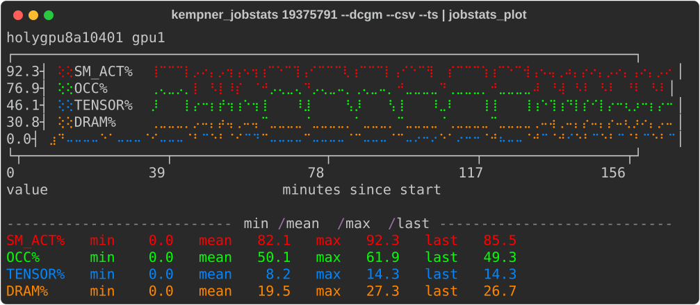
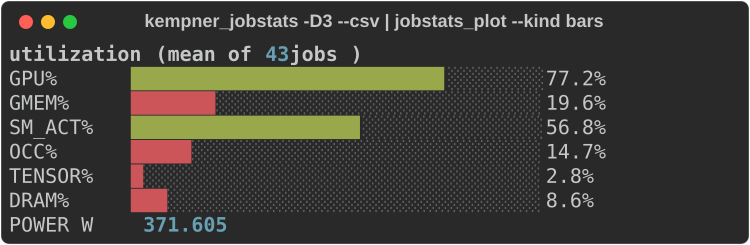

# kempner-jobstats

`kempner_jobstats` summarizes completed Kempner Slurm jobs. It reads existing
jobstats data from `sacct`, adds DCGM GPU metrics from Prometheus when available,
and can emit CSV for terminal plots.


## Screenshots

<table width="800">
  <tr>
    <td><strong>Per-job DCGM time series</strong></td>
  </tr>
  <tr>
    <td></td>
  </tr>
  <tr>
    <td><strong>Aggregated utilization across jobs</strong></td>
  </tr>
  <tr>
    <td></td>
  </tr>
</table>

Sample output:

```bash
./kempner_jobstats -S 2026-06-01 -E 2026-06-02
```

```text
  User:      bdesinghu
  Select:    2026-06-01 .. 2026-06-02
JOBID        STATE     GPUS GPU%   GMEM%   SM_ACT%  OCC%    TENSOR%  DRAM%   POWER_W  RUNTIME      NAME
-------------------------------------------------------------------------------------------------------
17752673     COMPLETED 1    92     6       77.1     24.9    1.5      15.0    452      02:58:26     combo-pile
17752674     COMPLETED 1    78     38      52.3     15.3    6.9      7.8     388      00:13:34     eval-pile
18074321     COMPLETED 1    98     8       49.3     5.8     1.0      6.6     181      01:37:53     vae-wt103
18074323     COMPLETED 1    96     9       89.3     22.5    0.2      21.2    625      01:13:50     ar-wt103
18074325     COMPLETED 1    0      1       0.0      0.0     0.0      0.0     104      00:04:00     cache-wt103
18074326     COMPLETED 1    93     6       76.7     24.8    1.5      14.8    455      09:28:41     combo-wt103
-------------------------------------------------------------------------------------------------------
Mean:                       76     11      57.5     15.5    1.8      10.9    368
```
## Quick Start
You do not need to perform a formal installation. You can run `kempner_jobstats` using the pre-deployed cluster path or by cloning the repository directly.

Using the shared cluster path:
```bash
export JOBSTAT_PATH=/n/holylfs06/LABS/kempner_shared/Everyone/cluster_scripts/job_eff/kempner-jobstats

# View efficiency for the last 3 days
$JOBSTAT_PATH/kempner_jobstats -D 3

# Plot efficiency for a specific JOBID
$JOBSTAT_PATH/kempner_jobstats --dcgm --ts --csv <JOBID> | ./plot_util/jobstats_plot --compact
```
Downloading the scripts:
```bash
git clone https://github.com/KempnerInstitute/kempner-jobstats
cd kempner-jobstats

# View efficiency for the last 3 days
./kempner_jobstats -D 3

# Plot efficiency for a specific JOBID
./kempner_jobstats --dcgm --ts --csv <JOBID> | ./plot_util/jobstats_plot --compact
```
Dependencies:
For instructions on plotting dependencies and setting up your own virtual environment, please refer to plot_util/README.md.
For plotting dependencies, including how to use your own venv, see [`plot_util/README.md`](plot_util/README.md).


## Common Commands

See command args
```bash
kempner_jobstats -h
```
Some common command need and options
| Need | Command |
|---|---|
| Recent GPU jobs | `kempner_jobstats -D 3` |
| CPU + GPU summary without Prometheus | `kempner_jobstats --cgpu -D 2` |
| CPU-only summary | `kempner_jobstats --cpu -D 5` |
| GPU diagnosis labels | `kempner_jobstats --diagnose -D 5` |
| Per-node / per-GPU detail | `kempner_jobstats -d JOBID` |
| Per-GPU DCGM table | `kempner_jobstats --dcgm --ext JOBID` |
| Raw DCGM time series CSV | `kempner_jobstats --dcgm --ts --csv JOBID > ts.csv` |
| Plot saved CSV | `jobstats_plot -f ts.csv --compact` |

Selectors such as `-N`, `-D`, `-S/-E`, `-u`, `-A`, `-p`, and `-t` work across
views. Run `kempner_jobstats --help` for all options and
`kempner_jobstats --describe` for column definitions.

## Views

- `--gpu` is the default view for GPU jobs. It includes DCGM metrics when
  Prometheus data is available.
- `--cgpu` and `--cpu` are offline views based only on stored jobstats data.
- `--diagnose` adds a short GPU diagnosis label.
- `--dcgm` shows one row per GPU. Add `--ext` for more metrics or `--ts --csv`
  for raw time-series samples.
- `--csv` makes any view machine-readable and pipeable to `jobstats_plot`.

## Plots

`jobstats_plot` renders `kempner_jobstats --csv` output as terminal bars,
histograms, heatmaps, and time-series plots.

```bash
kempner_jobstats --gpu  --csv JOBID      | ~/plot_util/jobstats_plot
kempner_jobstats --gpu  --csv -D 3       | ~/plot_util/jobstats_plot --kind bars
kempner_jobstats --dcgm --ts --csv JOBID | ~/plot_util/jobstats_plot --compact
```

See [`plot_util/README.md`](plot_util/README.md) for plotting setup and options.


## References

- [FASRC jobstats documentation](https://docs.rc.fas.harvard.edu/kb/jobstats/)
- [Princeton jobstats](https://princetonuniversity.github.io/jobstats/)
- For live monitoring, use [KempnerPulse](https://github.com/KempnerInstitute/kempnerpulse)
